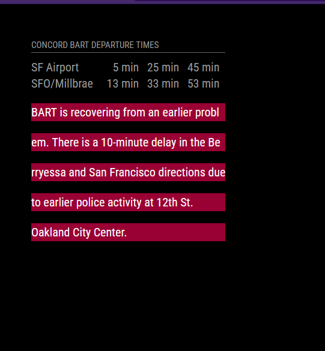

# MMM-BartTimes

Magic Mirror module that displays the upcoming departure times for all BART (Bay Area Rapid Transit) lines at a certain station, plus any active service advisories.

It can also show departures for **any Bay Area transit agency** (Muni, AC Transit, Caltrain, VTA, SamTrans, Golden Gate, …) via the regional [511 API](https://511.org/open-data/transit) — a single module instance can render several agency/stop pairs at once.

This module reads [GTFS-Realtime](https://www.bart.gov/schedules/developers/gtfs-realtime) feeds (trip updates and service alerts) and joins them against the [static GTFS schedule](https://www.bart.gov/schedules/developers/gtfs) to compute live departure times. BART's own feeds need no API key; 511 requires a free key (see below).

### Installation
1. Navigate to the magic mirror modules directory and clone this repository there.
2. Inside the `MMM-BartTimes` folder, run `npm install` to install dependencies.
3. Modify `config.js` to include `MMM-BartTimes`. An example config is below.

### Configuration

| Config Option | Type | Description |
|:------------- |:--------- |:----------- |
| `station` | string | (Legacy single-BART form.) The 4-letter station abbreviation (e.g. `DBRK`, `19TH`, `MONT`). Match is case-insensitive. Codes can be found in BART's [stops.txt](https://www.bart.gov/dev/schedules/google_transit.zip) (the `stop_id` column for parent stations). Ignored when `stops` is set. |
| `train_blacklist` | list of strings (optional) | Destination **station codes** to hide, matched case-insensitively against each train's terminus (e.g. `DUBL`, `RICH`, `DALY`). The terminus is derived from static `stop_times` (the realtime feed truncates before the terminus, so it can't be used). Codes are the `stop_id`s of parent stations in [stops.txt](https://www.bart.gov/dev/schedules/google_transit.zip). If a stop's feed has no `stop_times`, this falls back to a case-insensitive substring match on the headsign text. For the multi-stop form, set `train_blacklist` per stop instead. |
| `stops` | list of objects (optional) | Multi-agency form. Each entry: `{ provider, agency, station, label?, apiKey?, train_blacklist? }`. When set, it takes precedence over the legacy `station` field. |
| `apiKey` | string (optional) | Your free 511 token, used by any `provider: '511'` stop. Register at [511.org/open-data/token](https://511.org/open-data/token). Can also be set per stop. |
| `advisory_blacklist` | list of strings (optional) | Hide any advisory whose text contains one of these substrings (case-insensitive), e.g. `['clipper', 'tap and ride']` to mute recurring ads. Applies to every stop; a stop may add its own list. Default: `[]`. |
| `advisoryMaxLength` | integer | Truncate each advisory to this many characters (at a word boundary, with `…`). `0` disables truncation. Default: `160`. |
| `maxAdvisories` | integer | Show at most this many advisories per stop after muting. `0` means no limit. Default: `0`. |
| `showFullHeadsign` | boolean | BART headsigns are full line paths (`SF / OAK Airport / Dublin/Pleasanton`). By default only the final destination segment is shown (`Dublin/Pleasanton`) to keep the column narrow. Set `true` to show the whole path. Default: `false`. |
| `trainUpdateInterval` | integer | Departure refresh interval, in ms. Default: 30000 (30s). 511 stops are floored to ≥90s to respect the token's rate limit. |
| `advisoryUpdateInterval` | integer | Advisory refresh interval, in ms. Default: 1800000 (30 min). |

Per-stop fields (entries of `stops`):

| Field | Type | Description |
|:----- |:---- |:----------- |
| `provider` | string | `'bart'` (default, keyless) or `'511'`. |
| `agency` | string | 511 operator id, required for `provider: '511'`. E.g. `BA` (BART), `SF` (Muni), `AC` (AC Transit), `CT` (Caltrain), `SC` (VTA), `SM` (SamTrans), `GG` (Golden Gate). Full list: `https://api.511.org/transit/operators?api_key=YOUR_TOKEN`. |
| `station` | string | The GTFS `stop_id` to show. For BART use the 4-letter code (`19TH`); for 511 agencies use the exact numeric `stop_id` from that operator's GTFS (see below). |
| `label` | string (optional) | Heading shown for this stop. Defaults to the GTFS station name. |
| `apiKey` | string (optional) | Overrides the top-level `apiKey` for this stop. |
| `train_blacklist` | list of strings (optional) | Destination station codes to hide for this stop (see the top-level `train_blacklist` for matching details). |
| `advisory_blacklist` | list of strings (optional) | Extra advisory mute substrings for this stop, combined with the top-level list. |

Example — legacy single BART station (no key needed):
```
{
    module: 'MMM-BartTimes',
    position: 'top_left',
    config: {
        station: '19TH',
        train_blacklist: ['DUBL'],   // hide Dublin/Pleasanton-bound trains
    }
},
```

Example — BART + Muni together via 511:
```
{
    module: 'MMM-BartTimes',
    position: 'top_left',
    config: {
        apiKey: 'YOUR_511_TOKEN',
        stops: [
            { provider: 'bart', station: '19TH', label: '19th St BART' },
            { provider: '511', agency: 'SF', station: '13915', label: 'Church & Market (Muni)' },
        ],
    }
},
```

### Notes
- The static GTFS bundle for each provider/agency is downloaded on first use and refreshed every 24 hours.
- **Finding a 511 `agency` and `stop_id`:** list operators at `https://api.511.org/transit/operators?api_key=YOUR_TOKEN`, then download that operator's schedule from `https://api.511.org/transit/datafeeds?api_key=YOUR_TOKEN&operator_id=AGENCY` and read the `stop_id` column of `stops.txt`.
- **511 rate limits:** a token allows a limited number of requests per hour. This module floors 511 refresh intervals to ≥90s and shares one feed fetch across multiple stops on the same agency, but if you add many 511 stops you may still need to raise your intervals or request a higher limit from 511.
- BART does not publish vehicle positions in GTFS-RT, and eBART trips (Pittsburg Center / Antioch) may not appear because their schedules are managed in a separate system.
- **Advisories are often system-wide.** BART scopes every alert to the whole agency (not a specific stop), so every station shows all current alerts — including recurring ads like "Tap and Ride" / Clipper. Use `advisory_blacklist` to mute those, `advisoryMaxLength` to keep long alerts readable, and `maxAdvisories` to cap how many show. BART also does not populate the GTFS-RT `severity`/`cause`/`effect` fields (they come through as `UNKNOWN`), so the module cannot color or sort advisories by severity for BART.
- **Module width** is capped in `bart_times.css` (`.MMM-BartTimes { max-width }`) so a long advisory banner wraps in its own column instead of stretching the region across the screen. Adjust that value if you want the module wider or narrower.

### Development

See [DEVELOPMENT.md](DEVELOPMENT.md) for the local MagicMirror harness
(`./dev/run.sh`), tests (`npm test`), and the release process. For
code internals see [AGENTS.md](AGENTS.md).

### Screenshot

When running and a BART disruption is happening, looks like this


